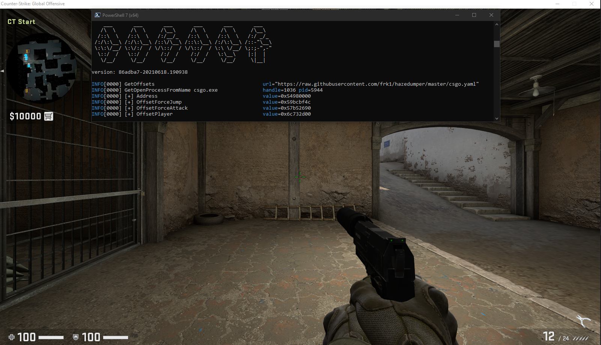

# Gohack 

[![Latest Tag][6]][5] [![Travis CI][3]][4] [![Go Report][1]][2]

- Injected from external process.
- Tested against stub process and dlls.
- Tested against local bots.
- Assume you will be banned on VAC secured servers.
- Credit to [1jz][7] which this was originally based on.



## Usage

```
.\gohack.exe
```

## Download

You can download [here][5].

[1]: https://goreportcard.com/badge/github.com/jamesmoriarty/gohack
[2]: https://goreportcard.com/report/github.com/jamesmoriarty/gohack
[3]: https://travis-ci.org/jamesmoriarty/gohack.svg?branch=master
[4]: https://travis-ci.org/jamesmoriarty/gohack
[5]: https://github.com/jamesmoriarty/gohack/releases
[6]: https://img.shields.io/github/v/tag/jamesmoriarty/gohack.svg?logo=github&label=latest
[7]: https://github.com/1jz/csgo-go-bhop